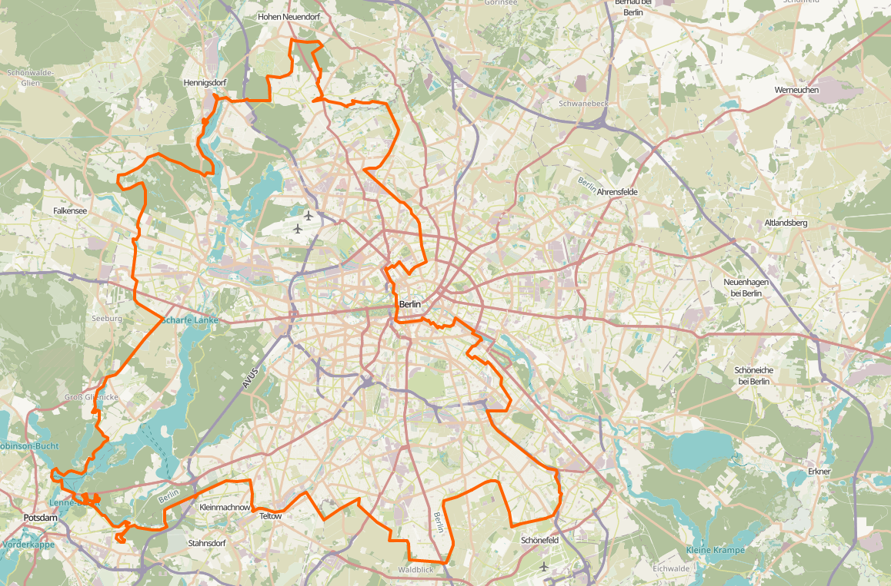

## sense-history


Have you ever wondered how often you would have to cross the former Berlin Wall on your daily route to work? Which trees were already there 100 years ago? Where did during the Second World War the people find shelter during military attacks? 

We all have the tools to answer these questions. However, it can be challenging to relate to numbers and put them into perspective. But what does it actually mean to split a city right in the middle with a 140 kilometer long wall?

The goal of *sense-history* make part of a cities' history perceptible.

It is a wearable device that signals historic landmarks. So, while going through your daily life you can get sense on how your city looked years ago, discover the history of its buildings and experience the dimension of historic changes. It will vibrate as soon as the Berlin wall is crossed or if you are near to a 100 year old tree.


*sense-history* is a Raspberry Pi project. Select a module for your city (or add your own) and setup your Raspberry Pi with a GPS tracker and vibration motor such that it gives a signal as soon as you are close to point of interest.


### Modules




In general, any geospatial data can be transformed into a module.
A module takes care that the geospatial data is interpreted correctly and squared with the current GPS location. 

Right now, It's possible to signal a vibration in two different use cases:

​	(1) when the current location is close enough to a point of interest in the data 
​		 e.g. when we are standing in a 2 meter radius of a tree older than 100 years

​	(2) when a specific line is crossed or predetermined areas are entered or left
​		 e.g. when crossing the Berlin wall from the east to the west sector (or the other way around)


In this repo three modules are included:

- The Berlin Wall
- Historic Points in Berlin
- Trees in Berlin
- Trees in Zurich


All modules options are listed and configured in `./modules/config.py`

Finding adequate geospatial data can be time-consuming and tedious. If you have ideas for modules, tips for sources or even processed data, please create a pull request or reach out to me.


### Documentation

The ./docs folder contains documentation regarding the [Hardware Setup](), as well as background information on [GPS Signal processing]().


### Run

Run Module:
``` ./run start ```


By default the Berlin Wall module is loaded. If you want to switch the module, change the corresponding flag in the `` main.py `` file:

```
flags.DEFINE_enum('module', 'BERLIN_WALL', ALL_MODULES, 'The module')
```


Another option is to immediately call ```main.py```flagging the selected module:

`python3 main.py --module=BERLIN_HISTORIC`

Other flags are the precision radius around a target landmark and the debug mode which outputs the logs in the console.

The defaults are set to:

``python3 main.py --module=BERLIN_WALL` --debug=False  --radius=5.0 ``


### Tests

Run lint and tests with:
``` ./run test ```


### Installation

To get *shapely* running install `libgeos` with:

``` sudo apt-get install libgeos-dev ```

For other dependencies run:

``` sudo pip install -r requirements.txt ```


Setup raspberry to start *sense-history* as soon as the Rasperry Pi has a power supply connected.

Therefore add the above scripts to the `etc/rc.local`file. Edit with root permissions.

For more information have a look at [this guide](https://www.dexterindustries.com/howto/run-a-program-on-your-raspberry-pi-at-startup/).

