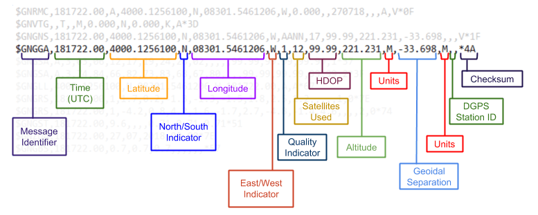

## Background Information - GPS

### Global Navigation Satellite Systems

To determine the geo-spatial position of a user, a satellite navigation system is required.
Different satellite navigation systems exist:

- Global Positioning System (GPS) by the United States
- Global Navigation Satellite System (GLONASS) by Russia
- BeiDou Navigation Satellite System (BDS) by China
- Quasi-Zenith Satellite System (QZSS) by Japan
- ...

While some satellite systems provide a global coverage (so called global navigation satellite systems (GNSS), others are focused on a high precision regional satellite navigation.

All of these systems use satellite navigation to provide geo-spatial positioning. Based on their radio signals receivers can determine their exact position, consisting of longitude, latitude and altitude.

GPS is a satellite navigation system with a global coverage that is widely used for military and civilian purposes. It is operated by the Air Force of the United States and was launched in 1978. As of February 2020, there are 31 satellites in the GPS constellation.

Comparison of the altitude of different satellite navigation systems (Image by Wikipedia).

More information about satellite systems can be found in this post [GPS, GLONASS, BDS, QZSS, GNSS, IRNSS: What are they?](https://www.yugatech.com/guides/gps-glonass-bds-qzss-gnss-irnss-what-are-they/) and on the corresponding [Wikipedia page](https://en.wikipedia.org/wiki/Satellite_navigation).

### Understanding the information from the GPS receiver

The information received from a satellite navigation system is transmitted with the *NMEA 0183 protocol*. NMEA stands for the National Marine Electronics Association which has developed a standard for the communication with marine electronics, including sonars, echo sounder, as well as GPS receivers.

The idea of NMEA is to send information in so called sentences. A sentence correspond is self contained and contained information is independent from other sentences. 

Each sentence follows a strict pattern:

 It starts with a *$* and ends with a newline character. It's maximum size is 80 characters and the different information pieces are separated by commas.

The following picture shows a typical NMEA sentence separated in it's data pieces:

​																																	Image by Brandi Downs

The first two letters in a NMEA sentence determine the used device:

- GP is used for GPS receivers
- GN shows that a combination of navigation systems was used to obtain the message data
- P stands for proprietary sentences, as with the NMEA protocol hardware manufactures can define their own sentences

The following three letters which encode the sentence content:

* GSA - Overall Satellite data
* GSV - Detailed Satellite data
* GRS - GPS Range Residuals
* GST - GPS Pseudorange Noise Statistics
* GLL - Lat/Lon data
* ZDA - Date and Time
* GGA - Fix information
* VTG - Vector track an Speed over the Ground
* RMX - recommended minimum data for gps

In the table below the combinations of sentence type and sentence content letters which are the socalled message identifier at the beginning of a NMEA sentence are listed:

​																														Image by GlobalTop Tech Inc.

For the *sense-history* project the GNGGA sentence is processed. It is commonly used with GPS receivers and provides data about the longitude, latitude, altitude. Further, it contains information about the number of satellites that are used and the accuracy of the horizontal position.

The following resources provide more information on NMEA sentences:

* Downs, Brandi. "Decoding NMEA Sentences." *brandi downs*, 5 August 2018,
  https://brandidowns.com/?p=77
* DePriest Dale. "NMEA data." *gpsinformation.net*,
  https://www.gpsinformation.org/dale/nmea.htm

- Raymond, Eric S. *NMEA Revealed*, 23 March 2019, Version 2.23,
  https://gpsd.gitlab.io/gpsd/NMEA.html

### Latitude and Longitude

##### Latitude

Lines of latitude are horizontal lines that stretch from east to west  across the globe. The latitude determines the north-south position on the earth's surface. The central line of latitude is the equator which represents 0° latitude. 

Both poles are at 90° latitude. While every line of latitude north of the equator is indicated by the letter *N*, all lines of latitude south of the equator are marked with an *S*.

Between the equator and the poles, each line of latitude increases by 1°. 

​																												Image by Jevon James

##### Longitude

Lines of longitude are vertical lines that stretch from the North Pole  to the South Pole. The longitude determines the east-west position of point on the earth's surface. The center longitude is the so called Prime Meridian which passes through the Royal Observatory in Greenwich. It is represented as 0° longitude. The lines of longitude range from 0° up to 180°. All lines of longitude which are located east of the Prime Meridian are marked with the letter *E*, all west of it with the letter *W*.

​																																	Image by Jevon James

#### Geographical Coordinates

Geographical coordinates consists of the latitude and longitude of a specific point on the Earth's surface. As a standard the line of latitude is always given first. For example, a geographical coordinates could be 13°S, 5°E.

However, the lines of latitude and longitude are not able to cover the Earth surface in detail. For example, between the 15°N and 16°N lay are approximately 111.32 km. An accurate location positioning, therefore, requires to further divide the lines of latitude and longitude.

In the following the most common three formats are explained (see James, Jevon. [How To Read GPS Coordinates](https://www.ubergizmo.com/how-to/read-gps-coordinates/):

**(1) Degrees, minutes, and seconds (DMS)**

The  space between each line of latitude or longitude representing 1° is  divided into 60 minutes, and each minute is divided into 60 seconds. An  example of this format is:

**41°24’12.2″N   2°10’26.5″E**

The line of latitude is read as 41 degrees (41°), 24 minutes (24′),  12.2 seconds (12.2”) north. The line of longitude is read as 2 degrees  (2°), 10 minutes (10′), 26.5 seconds (12.2”) east.

**(2) Degrees and decimal minutes (DMM)**

The  space between each line of latitude or longitude representing 1° is  divided into 60 minutes, and each minute is further divided and  expressed as decimals. An example of this format is:

**41 24.2028,  2 10.4418**

The  line of latitude is read as 41 degrees (41), 24.2028 minutes (24.2028)  north. The coordinate for the line of latitude represents north of the  Equator because it is positive. If the number is negative, it represents  south of the Equator.45.12345

The line of longitude is read as 2 degrees  (2), 10.4418 minutes (10.4418) east. The coordinate for the line of  longitude represents east of the Prime Meridian because it is positive.  If the number is negative, it represents west of the Prime Meridian.

**(3) Decimal degrees (DD)**

The  space between each line of latitude or longitude representing 1° is  divided and expressed as decimals. An example of this format is:

**41.40338,  2.17403**

The  line of latitude is read as 41.40338 degrees north. The coordinate for  the line of latitude represents north of the Equator because it is  positive. If the number is negative, it represents south of the Equator.

The  line of longitude is read as 2.17403 degrees east. The coordinate for  the line of longitude represents east of the Prime Meridian because it  is positive. If the number is negative, it represents west of the Prime  Meridian.

Resources:

- James, Jevon. "How To Read GPS Coordinates." *übergizmo*, 
  https://www.ubergizmo.com/how-to/read-gps-coordinates/
- Trimble Forestry. "Latitude/Longitude Formats and Conversion." *TNP Service & Support*,
  https://tnp.uservoice.com/knowledgebase/articles/172110-latitude-longitude-formats-and-conversion

