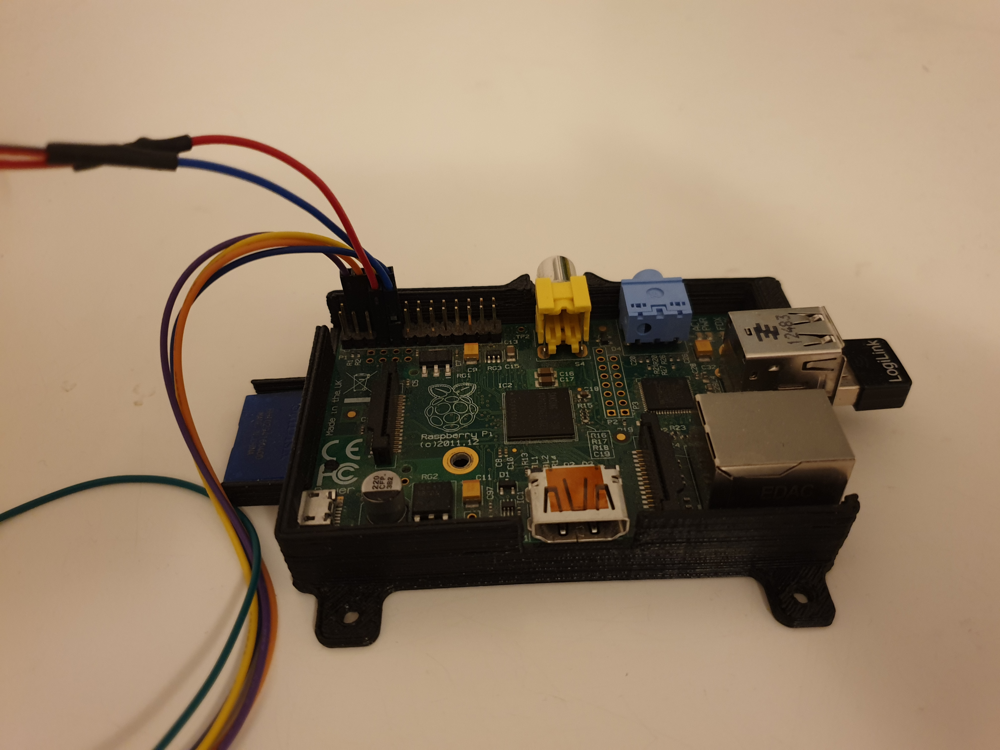
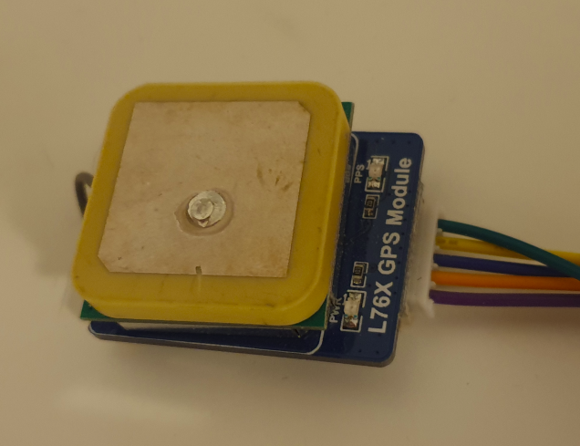
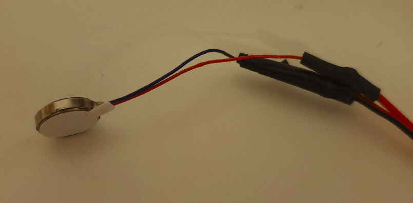
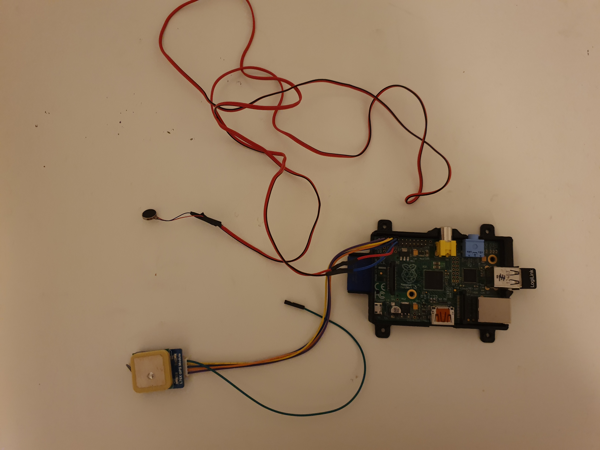
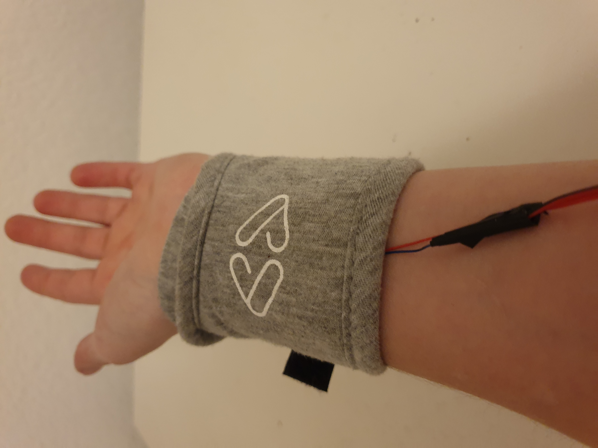

# Hardware Setup

The Hardware for *sense-history* consists of the following three parts:

- Raspberry Pi
- GPS Module
- Vibration Module

#### Raspberry Pi

The Raspberry Pi is the key module which runs the *sense-history* code, processes the information from the GPS module and controls the vibration module.

I used a pretty old Raspberry Pi version: Raspberry Pi 1 Module B 2011.12

However, the setup should be similar with different versions.

Getting started with Raspberry Pi?  Have a look at their [website](https://projects.raspberrypi.org/en) with great tutorials and projects.

#### GPS Module

To locate the current position of a user a GPS module is required.

I used the [L76X Multi-GNSS Module](https://www.waveshare.com/l76x-gps-module.htm) from Waveshare.

The [user manual](https://www.waveshare.com/w/upload/5/5b/L76X_GPS_Module_user_manual_en.pdf) describes how to connect and setup the GPS module with the Raspberry Pi.

#### Vibration Module

 As vibration module I used the [Pololu Shaftless Vibration Motor](https://eckstein-shop.de/Pololu-Shaftless-Vibration-Motor-10x20mm). With 10 x 2 mm it is really tiny and therefore perfect to be carried around.

The module is connected over the general-purpose input/output (GPIO) pins. 

[This guide](https://www.raspberrypi.org/documentation/usage/gpio/) gives an introduction on its usage. 

In python then the [Rpi.GPIO](https://pypi.org/project/RPi.GPIO/) is used control the module

#### Full Setup

When both modules are connected to the Raspberry the Hardware setup is ready.For the vibration motor I extended the cables to be

It is then fixed at the wrist with an adjusted sleeping mask on which I sewed a small pocket to safely store the vibration module. The Raspberry Pi with the GPS module and a external power supply are put in a small bag to be attached to a belt or jacket.

Full Setup | Wrist band 
:-------------------------:|:-------------------------:
  |  |

